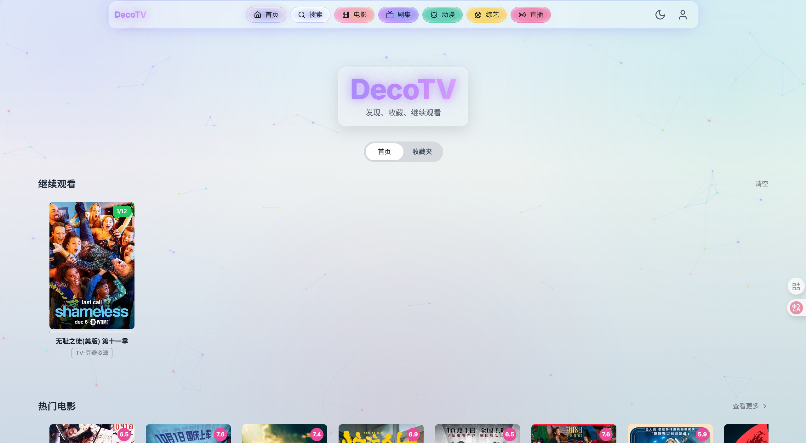
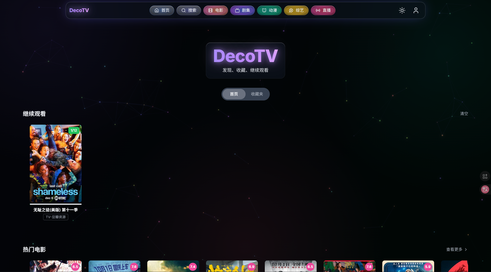

<!-- markdownlint-disable MD033 MD026 MD034 -->

# DecoTV

<div align="center">
  
</div>

> 🎬 DecoTV 是一个开箱即用的、跨平台的影视聚合播放器。基于 Next.js 14 + Tailwind CSS + TypeScript 构建，支持多资源搜索、在线播放、收藏同步、播放记录、云端存储，让你随时随地畅享海量免费影视内容。

<div align="center">


</div>

---

## 🎬 项目展示

<div align="center">
  <table>
    <tr>
      <td align="center">
        
        <br>
        <sub><b>明亮模式</b></sub>
      </td>
      <td align="center">
        
        <br>
        <sub><b>暗夜模式</b></sub>
      </td>
    </tr>
  </table>
</div>

---

### ⚠️ 重要提醒

> 注意：部署后项目为空壳项目，无内置播放源和直播源，需要自行收集配置。  
> 免责声明：请不要在 B 站、小红书、微信公众号、抖音、今日头条或其他中国大陆社交平台发布视频或文章宣传本项目，不授权任何“科技周刊/月刊”类项目或站点收录本项目。

## ✨ 功能特性

- 🔍 多源聚合搜索：一次搜索立刻返回全源结果
- 📄 丰富详情页：支持剧集列表、演员、年份、简介等完整信息展示
- ▶️ 流畅在线播放：集成 HLS.js & ArtPlayer
- ❤️ 收藏 + 继续观看：支持 Kvrocks/Redis/Upstash 存储，多端同步进度
- 📱 PWA：离线缓存、安装到桌面/主屏，移动端原生体验
- 🌗 响应式布局：桌面侧边栏 + 移动底部导航，自适应各种屏幕尺寸
- 🧩 可插拔采集源配置：支持管理后台加载/订阅配置
- 🛡 注册开关：可通过环境变量显式开启/关闭注册，默认关闭

<details>
  <summary>点击查看更多截图</summary>
  
  
</details>

---

## 🗺 目录

- [🎬 项目展示](#-项目展示)
- [✨ 功能特性](#-功能特性)
- [🛠 技术栈](#-技术栈)
- [🚀 部署](#-部署)
- [🐳 镜像地址](#-镜像地址)
- [⚙️ 配置文件](#️-配置文件)
- [🔄 自动更新](#-自动更新)
- [🔁 与上游同步（CI）](#-与上游同步ci)
- [🌍 环境变量](#-环境变量)
- [📺 AndroidTV 使用](#-androidtv-使用)
- [🎥 TVbox 配置](#-tvbox-配置)
- [🔒 安全与隐私提醒](#-安全与隐私提醒)
- [📄 License](#-license)
- [🙏 致谢](#-致谢)
- [📈 Star History](#-star-history)
- [💝 赞赏支持](#-赞赏支持)

## 🛠 技术栈

| 分类      | 主要依赖                                                                                              |
| --------- | ----------------------------------------------------------------------------------------------------- |
| 前端框架  | [Next.js 14](https://nextjs.org/) · App Router                                                        |
| UI & 样式 | [Tailwind CSS 3](https://tailwindcss.com/)                                                            |
| 语言      | TypeScript 4                                                                                          |
| 播放器    | [ArtPlayer](https://github.com/zhw2590582/ArtPlayer) · [HLS.js](https://github.com/video-dev/hls.js/) |
| 代码质量  | ESLint · Prettier · Jest                                                                              |
| 部署      | Docker                                                                                                |

---

## 🚀 部署

本项目推荐使用 Docker 或基于 Docker 的平台部署。

### 先决条件

- 准备一组站长账户/密码（用于初始登录）
- 选择一种数据存储方式：Kvrocks（推荐）/ Redis / Upstash

### Kvrocks 存储（推荐）

```yml
services:
  decotv-core:
    image: ghcr.io/10000ge10000/decotv:latest
    container_name: decotv-core
    restart: on-failure
    ports:
      - '3000:3000'
    environment:
      - USERNAME=admin
      - PASSWORD=admin_password
      - NEXT_PUBLIC_STORAGE_TYPE=kvrocks
      - NEXT_PUBLIC_ENABLE_REGISTER=true # 开放注册（默认关闭）
      - KVROCKS_URL=redis://decotv-kvrocks:6666
    networks:
      - decotv-network
    depends_on:
      - decotv-kvrocks
  decotv-kvrocks:
    image: apache/kvrocks
    container_name: decotv-kvrocks
    restart: unless-stopped
    volumes:
      - kvrocks-data:/var/lib/kvrocks
    networks:
      - decotv-network
networks:
  decotv-network:
    driver: bridge
volumes:
  kvrocks-data:
```

### Redis 存储（有一定的丢数据风险）

```yml
services:
  decotv-core:
    image: ghcr.io/10000ge10000/decotv:latest
    container_name: decotv-core
    restart: on-failure
    ports:
      - '3000:3000'
    environment:
      - USERNAME=admin
      - PASSWORD=admin_password
      - NEXT_PUBLIC_STORAGE_TYPE=redis
      - NEXT_PUBLIC_ENABLE_REGISTER=true # 开放注册（默认关闭）
      - REDIS_URL=redis://decotv-redis:6379
    networks:
      - decotv-network
    depends_on:
      - decotv-redis
  decotv-redis:
    image: redis:alpine
    container_name: decotv-redis
    restart: unless-stopped
    networks:
      - decotv-network
    # 请开启持久化，否则升级/重启后数据丢失
    volumes:
      - ./data:/data
networks:
  decotv-network:
    driver: bridge
```

### Upstash 存储

1. 在 [Upstash](https://upstash.com/) 注册账号并新建 Redis 数据库
2. 复制该数据库的 HTTPS ENDPOINT 与 TOKEN
3. 使用如下 Compose

```yml
services:
  decotv-core:
    image: ghcr.io/10000ge10000/decotv:latest
    container_name: decotv-core
    restart: on-failure
    ports:
      - '3000:3000'
    environment:
      - USERNAME=admin
      - PASSWORD=admin_password
      - NEXT_PUBLIC_STORAGE_TYPE=upstash
      - NEXT_PUBLIC_ENABLE_REGISTER=true # 开放注册（默认关闭）
      - UPSTASH_URL=你的 HTTPS ENDPOINT
      - UPSTASH_TOKEN=你的 TOKEN
```

---

## 🐳 镜像地址

- GitHub Container Registry: `ghcr.io/10000ge10000/decotv:latest`

> 若你 Fork 到自己的仓库，请将镜像前缀替换为你自己的 GitHub 用户名或组织名。

---

## ⚙️ 配置文件

应用初始为空壳，无任何播放源。请在管理后台的“配置文件设置”中填入采集源配置（后续会支持订阅导入）。

示例：

```json
{
  "cache_time": 7200,
  "api_site": {
    "dyttzy": {
      "api": "http://xxx.com/api.php/provide/vod",
      "name": "示例资源",
      "detail": "http://xxx.com"
    }
  },
  "custom_category": [
    {
      "name": "华语",
      "type": "movie",
      "query": "华语"
    }
  ]
}
```

字段说明：

- `cache_time`：接口缓存时间（秒）
- `api_site`：可自由增删替换
  - `key`：小写字母/数字唯一标识（管理端里会展示）
  - `api`：V10 格式 `vod` JSON API 根地址
  - `name`：展示名称
  - `detail`：可选，对不提供完整 API 的站点用于解析详情页
- `custom_category`：自定义分类（会出现在导航）
  - `name`：显示名（可选）
  - `type`：`movie`/`tv`
  - `query`：豆瓣搜索关键字

已知可用的 `custom_category`：

- movie：热门、最新、经典、豆瓣高分、冷门佳片、华语、欧美、韩国、日本、动作、喜剧、爱情、科幻、悬疑、恐怖、治愈
- tv：热门、美剧、英剧、韩剧、日剧、国产剧、港剧、日本动画、综艺、纪录片

> DecoTV 支持标准的苹果 CMS V10 API 格式。

---

## 🔄 自动更新

- 可使用 [watchtower](https://github.com/containrrr/watchtower) 监控并自动拉取最新镜像
- dockge/komodo 等 Compose UI 也可开启自动更新

---

## 🔁 与上游同步（CI）

本仓库内置一套 GitHub Actions 工作流，定时与上游同步并“冲突时保留本地改动”。

- 工作流文件：`.github/workflows/sync-upstream.yml`
- 默认策略：
  - 合并参数：`-X ours`（冲突保留本地）
  - 触发：每天 03:00 UTC 自动运行
  - 模式：直接 push（无 PR）
  - 上游：`Decohererk/DecoTV`，分支 `main`
  - 目标：当前仓库 `main`
- 手动触发
  - 到 Actions 页面运行 “Sync upstream (preserve local changes)”
  - 也可以覆盖 run_mode（push/pr），但默认 push

> 若你需要改为“先 PR 再合并”，可在手动运行时选择 `pr` 模式。

---

## 🌍 环境变量

| 变量                                | 说明                             | 可选值                                                                | 默认值                                                                                                                     |
| ----------------------------------- | -------------------------------- | --------------------------------------------------------------------- | -------------------------------------------------------------------------------------------------------------------------- |
| USERNAME                            | 站长账号                         | 任意字符串                                                            | 无（必填）                                                                                                                 |
| PASSWORD                            | 站长密码                         | 任意字符串                                                            | 无（必填）                                                                                                                 |
| SITE_BASE                           | 站点 url                         | 形如 https://example.com                                              | 空                                                                                                                         |
| NEXT_PUBLIC_SITE_NAME               | 站点名称                         | 任意字符串                                                            | DecoTV                                                                                                                     |
| ANNOUNCEMENT                        | 站点公告                         | 任意字符串                                                            | 本网站仅提供影视信息搜索服务，所有内容均来自第三方网站。本站不存储任何视频资源，不对任何内容的准确性、合法性、完整性负责。 |
| NEXT_PUBLIC_STORAGE_TYPE            | 存储方式                         | redis / kvrocks / upstash / localstorage                              | localstorage                                                                                                               |
| KVROCKS_URL                         | Kvrocks 连接 URL                 | URL                                                                   | 空                                                                                                                         |
| REDIS_URL                           | Redis 连接 URL                   | URL                                                                   | 空                                                                                                                         |
| UPSTASH_URL                         | Upstash HTTPS ENDPOINT           | URL                                                                   | 空                                                                                                                         |
| UPSTASH_TOKEN                       | Upstash TOKEN                    | Token                                                                 | 空                                                                                                                         |
| NEXT_PUBLIC_SEARCH_MAX_PAGE         | 搜索可拉取的最大页数             | 1-50                                                                  | 5                                                                                                                          |
| NEXT_PUBLIC_DOUBAN_PROXY_TYPE       | 豆瓣数据源请求方式               | direct/cors-proxy-zwei/cmliussss-cdn-tencent/cmliussss-cdn-ali/custom | direct                                                                                                                     |
| NEXT_PUBLIC_DOUBAN_PROXY            | 自定义豆瓣数据代理 URL           | URL 前缀                                                              | 空                                                                                                                         |
| NEXT_PUBLIC_DOUBAN_IMAGE_PROXY_TYPE | 豆瓣图片代理类型                 | direct/server/img3/cmliussss-cdn-tencent/cmliussss-cdn-ali/custom     | direct                                                                                                                     |
| NEXT_PUBLIC_DOUBAN_IMAGE_PROXY      | 自定义豆瓣图片代理 URL           | URL 前缀                                                              | 空                                                                                                                         |
| NEXT_PUBLIC_DISABLE_YELLOW_FILTER   | 关闭色情内容过滤                 | true/false                                                            | false                                                                                                                      |
| NEXT_PUBLIC_FLUID_SEARCH            | 是否开启搜索接口流式输出         | true/false                                                            | true                                                                                                                       |
| NEXT_PUBLIC_ENABLE_REGISTER         | 是否开启注册（数据库模式才有效） | true/false                                                            | false                                                                                                                      |

说明：

- 注册功能需同时满足：
  1. `NEXT_PUBLIC_ENABLE_REGISTER='true'`
  2. `NEXT_PUBLIC_STORAGE_TYPE` ≠ `localstorage`
- 站长账户由 `USERNAME/PASSWORD` 控制，不允许通过注册接口覆盖

### 豆瓣代理类型解释（简）

- direct：服务器/浏览器直接请求豆瓣源站
- cors-proxy-zwei：由 @Zwei 提供的 CORS 代理
- cmliussss-cdn-tencent / cmliussss-cdn-ali：由 @CMLiussss 提供 CDN
- custom：自行提供代理前缀，由 `NEXT_PUBLIC_DOUBAN_PROXY` / `NEXT_PUBLIC_DOUBAN_IMAGE_PROXY` 指定

---

## 📺 AndroidTV 使用

- 可配合 [OrionTV](https://github.com/zimplexing/OrionTV) 在 Android TV 上使用
- 已实现播放记录与网页端同步

---

## 🎥 TVbox 配置

详见 [TVBox 配置优化说明](https://github.com/10000ge10000/DecoTV/blob/main/TVBox%E9%85%8D%E7%BD%AE%E4%BC%98%E5%8C%96%E8%AF%B4%E6%98%8E.md) ，详细功能见 `/admin` 管理页面中的 “TVbox 配置”。

---

## 🔒 安全与隐私提醒

### 强烈建议设置密码并关闭公网注册

- 为了安全与合规，建议默认关闭注册（本项目已默认关闭）
- 若必须开启注册，请仅在可信局域网内使用，并设置强密码

### 部署要求

1. 设置环境变量 `PASSWORD`（强密码）
2. 仅供个人/家庭使用，不要公开分享
3. 确保行为符合当地法律法规

### 重要声明

- 本项目仅供学习和个人使用
- 请勿将部署的实例用于商业用途或公开服务
- 如因公开分享导致的任何法律问题，用户需自行承担
- 项目开发者不对用户的使用行为承担任何法律责任
- 本项目不在中国大陆地区提供服务。如有该项目在向中国大陆地区提供服务，属个人行为。在该地区使用所产生的法律风险与责任，属于用户个人，与本项目无关

---

## 📄 License

[MIT](LICENSE) © 2025 DecoTV & Contributors

---

## 🙏 致谢

- [ts-nextjs-tailwind-starter](https://github.com/theodorusclarence/ts-nextjs-tailwind-starter) — 初始脚手架
- [LibreTV](https://github.com/LibreSpark/LibreTV) — 灵感来源
- [ArtPlayer](https://github.com/zhw2590582/ArtPlayer) — 网页视频播放器
- [HLS.js](https://github.com/video-dev/hls.js) — HLS 流在浏览器中的播放支持
- [Zwei](https://github.com/bestzwei) — 提供豆瓣数据 CORS 代理
- [CMLiussss](https://github.com/cmliu) — 提供豆瓣 CDN 服务
- 感谢所有提供免费影视接口的站点

---

## 📈 Star History

<div align="center">
  <a href="https://star-history.com/#10000ge10000/DecoTV&Date">
    <picture>
      <source media="(prefers-color-scheme: dark)" srcset="https://api.star-history.com/svg?repos=10000ge10000/DecoTV&type=Date&theme=dark" />
      <source media="(prefers-color-scheme: light)" srcset="https://api.star-history.com/svg?repos=10000ge10000/DecoTV&type=Date" />
      
    </picture>
  </a>
</div>

---

## 💝 赞赏支持

如果这个项目对你有所帮助，欢迎 Star ⭐ 本项目或请作者喝杯咖啡 ☕

<div align="center">
  <table>
    <tr>
      <td align="center">
        
        <br>
        <sub><b>🎨 微信赞赏</b></sub>
      </td>
    </tr>
  </table>
</div>

---

<div align="center">
  <p><strong>🌟 如果觉得项目有用，请点个 Star 支持一下！🌟</strong></p>
  <p>
    <sub>Made with ❤️ by <a href="https://github.com/10000ge10000">10000ge10000</a> and <a href="https://github.com/10000ge10000/DecoTV/graphs/contributors">Contributors</a></sub>
  </p>
</div>
